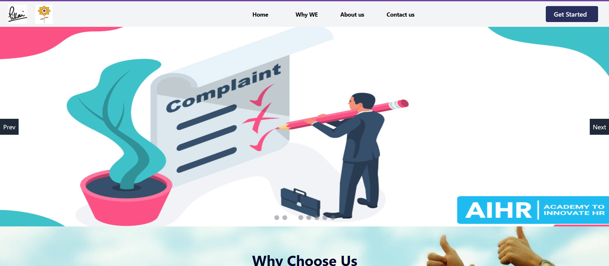
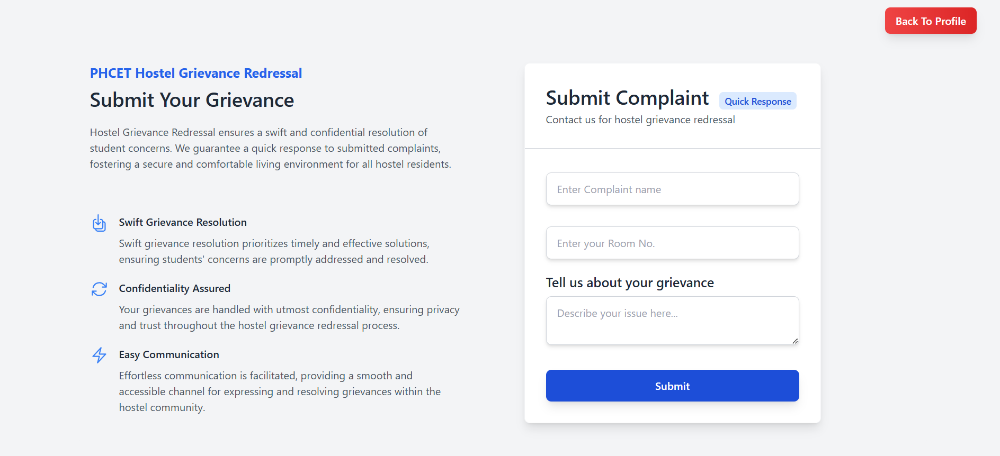
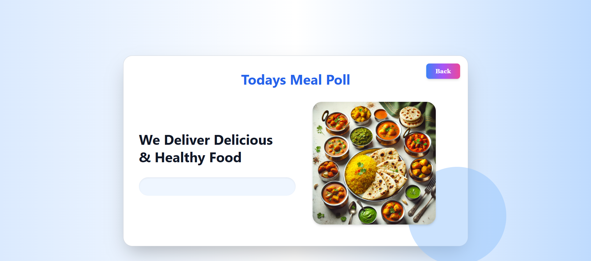

# Hostel Hub

**Hostel Hub** is a web application designed to bridge the gap between hostel students and the warden. It serves as a platform for students to communicate with the warden, **raise complaints**, **participate in meal polls**, and **interact with other students based on shared hobbies**. The project aims to improve the hostel living experience by providing a centralized platform for essential operations.

## Features

- **Student Dashboard**:
  - **Raise Complaints**: Students can raise personal or public complaints regarding their hostel facilities (e.g., room issues, cleanliness).
  - **Meal Poll**: Students can vote on the meal menu for the day, with options provided by the warden.
  - **Roommate Interaction**: Match with students based on similar hobbies or interests, allowing for easier interaction within the hostel.
  
- **Warden Dashboard**:
  - **View Complaints**: Wardens can view all student complaints and take necessary actions.
  - **Manage Meal Menu**: Wardens can update and manage the list of available meals for each day.

**Note**: This project is under development and will be updated with more features as needed.

## Technologies Used

- **Frontend**:
  - **React**: Used to build the user interface and manage interactions.
  - **Tailwind CSS**: For styling and creating responsive layouts.
  - **React Router**: For handling navigation between different pages.
  - **Redux**: For state management, including user authentication and managing complaints, votes, and other user data.

- **Backend**:
  - **Node.js**: Used to handle server-side operations.
  - **Express.js**: For creating API endpoints to interact with the database and handle requests.
  - **MongoDB**: A NoSQL database for storing user data, complaints, votes, and meal information.

## Installation

**Note**: As the project is ongoing, the installation guide will be added once the project reaches a stable state.

## Screenshots

### **Key UI Screenshots**:

- **Intro Page**:
  

- **Complaint Submission**:
  

- **Meal Poll**:
  

- For more screenshots of the common pages UI, check out the [UI Screenshots folder](./Frontend/public/CommonPagesUI).
- For more screenshots of the Student pages UI, check out the [UI Screenshots folder](./Frontend/public/StudentUI).
- For more screenshots of the Warden pages UI, check out the [UI Screenshots folder](./Frontend/public/WardenUI).

### Stay tuned for more updates!

---

*Feel free to contact me for any further questions or improvements.*
